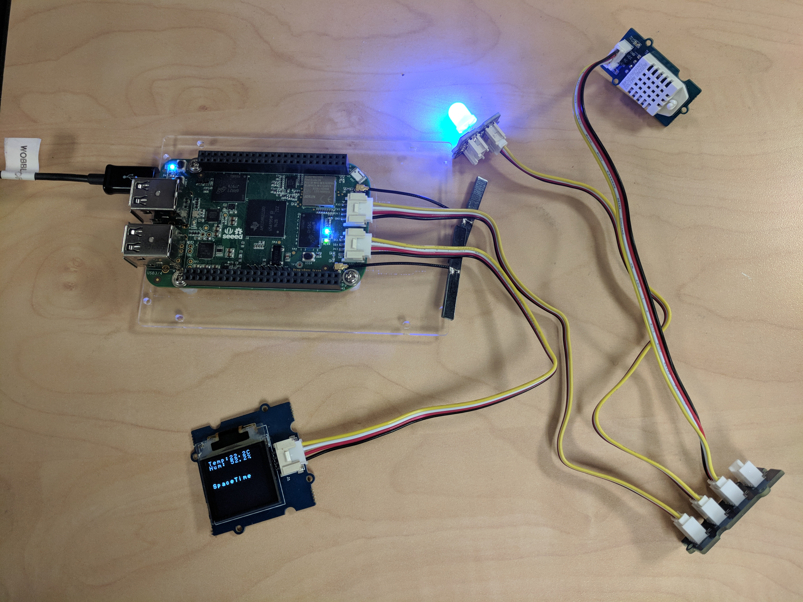
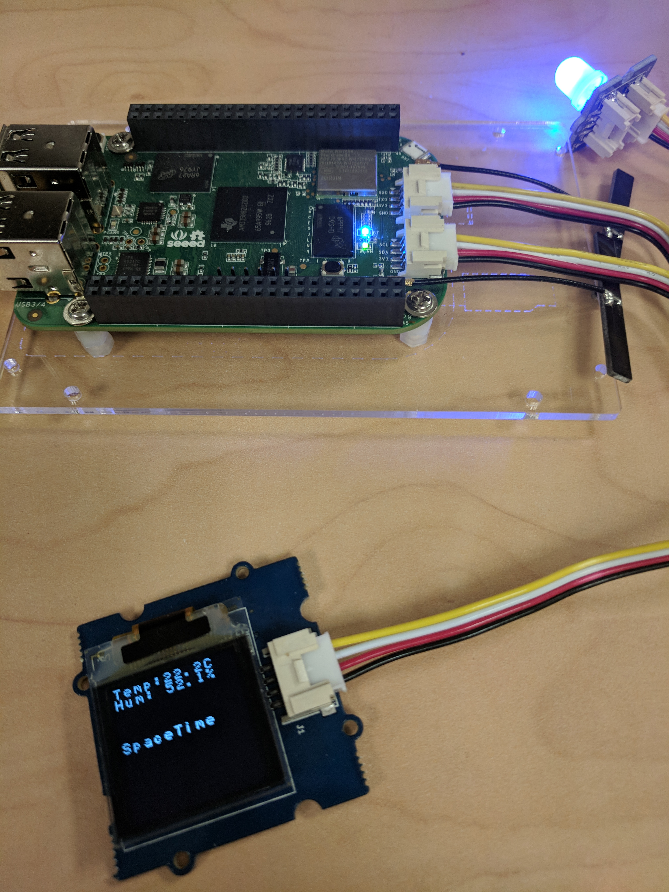

## BeagleBone Green Demo

<br>
NOTE: This README assumes you are familiar with the BeagleBone Green Wireless.

This project demonstrates how easy it is to build a BeagleBone Green IoT device and connect to the SpaceTime IoT Warp platform. This code has been tested with a BeagleBone Green Wireless, with a Grove Chainable RBG LED and Grove Temperature Sensor.

If you are starting from scratch, please follow the instructions for [Getting Started](http://beagleboard.org/getting-started). Once you have your BeagleBone connected and accessible, go ahead and SSH onto the device.

This project is composed of several Python scripts, Java components, and an Android app. The Python scripts do the actual
controlling of the BeagleBone sensors. The main script is `iot_demo.py`. This needs to be run as `sudo` in the background.
The Java components include the java application that implements the Nucleus SDK that provides connectivity and reads sensor data
and writes out control changes. Their also a Java Console application that allows you to send messages and LED changes
to the BeagleBone. You can run this from any computer. The Android application is a very simple mobile application that allows
you to control the BeagleBone.

#### What Exactly Can You Do?
This project demonstrates how to stream telemetry data, temperature and humidity, from the BeagleBone Green to the SpaceTime IoT Warp Platform via the
SDK. It also demonstrates how to send back messages to the device to control it. Their are two elements on the BeagleBone that
you can control, the LED light and the message displayed on the OLED screen. When there is no specific message being displayed,
or after 5 minutes of displaying the custom message, the device switches back to display the temperature and humidity.


### Connecting the Hardware
The parts to build this project include:

1) [BeagleBone Green Wireless Development Board](https://www.seeedstudio.com/BeagleBone-Green-Wireless-Development-Board%EF%BC%88TI-AM335x-WiFi%2BBT%EF%BC%89-p-2650.html)
2) [Temperature & Humidity Sensor Pro](https://www.seeedstudio.com/Grove-Temperature%26Humidity-Sensor-Pro%EF%BC%88AM2302%EF%BC%89-p-838.html)
3) [Seeedstudio Grove Starter Kit for BeagleBone Green](https://www.amazon.com/gp/product/B018FNOJUK/ref=oh_aui_detailpage_o07_s00?ie=UTF8&psc=1)


 
NOTE: The OLED Display, LED Chainable Sensor, and I2C Hub were part of the Starter Kit



#### Logging on using screen
When you connect the BeagleBone to your laptop using the USB, you have two options of connecting. The first is to use screen. 
The second is to use SSH. Sometimes the usb network connection does not always get set up correctly, so the fallback
is always the `screen` command. In either case, to confirm that the BeagleBone is mounted to your laptop, you should
find the tty in dev.

```
$ ls /dev/tty*usb*
```
Sometimes the device will show up as a usbmodem, othertimes it will show up as as usbserial. Here is an example of logging
in using screen where the device is identified as `tty.usbmodem1425`

```
$ screen /dev/tty.usbmodem1425 115200
```

#### Logging on using ssh
As the documentation explains, the mounted device should set up a USB network between the laptop and the device. The
address of the device will be 192.168.7.2.

#### Configuring the Wifi
There are instructions for configuring the wifi on the BeagleBone by selecting the AP and then configuring the
correct SID and passphrase. This does not always work. If it doesnt, the you will need to configure it manually
by logging onto the device and type the following

	$ connmanctl (invoke utility)
	connmanctl> tether wifi off (disable tethering)
	connmanctl> enable wifi (enable wifi radio)
	connmanctl> scan wifi (scan for AP, might take a few seconds)
	connmanctl> services (display detected AP)
	connmanctl> agent on (enable connection agent)
	connmanctl> connect wifi_*_managed_psk (connect to selected AP, might take some time, will prompt for password)
	connmanctl> quit
	
Test your connection...

    $ ping yahoo.com	

### Update the Software
When you're in, update your software:

```
apt-get update
apt-get upgrade
```
Now update your kernel (you should be running Debian by default) and reboot:

```
cd /opt/scripts/tools/
./update_kernel.sh
reboot
```

Your SSH connection should drop, but you can pull it back up as soon as the Beaglebone finishes rebooting.

> Note: These commands should all work if you are SSHed in as the root user. If you're working as the debian user, you may need to add "sudo" to the front of the commands. The default password for the Beaglebone is "temppwd".

Next, you will need to have Java 8 JDK [installed on your BBG](http://beagleboard.org/project/java/). 

Everything you need to build, or rebuild the project, is included in this project. The project uses Gradle and includes a `build.gradle`. If you are using Eclipse or IntelliJ, simply import the project from sources.

The tasks to build the project are: 

	./gradle clean build release

After you have built the project, navigate to the `release` directory to find the weatherstation-1.0.zip file.

Move this to a desired directory where you will unzip to. You will see the executable JAR and supporting libraries.

Next, edit the local.properties file and set the api_accountid, api_accounttoken, api_key, and api_token to the values of your account and partition from the nucleus application console.

Also, set the latitude and longitude of your station, along with its name, and a site name.

To find you location, simply open [https://www.google.com/maps](https://www.google.com/maps) and find your location on the map. Zoom in to get a precise location (or enter the address). Click and hold for a moment and you will get the latitude and longitude coordinates of that location. 

Finally, type 

	./run_bbg.sh


 