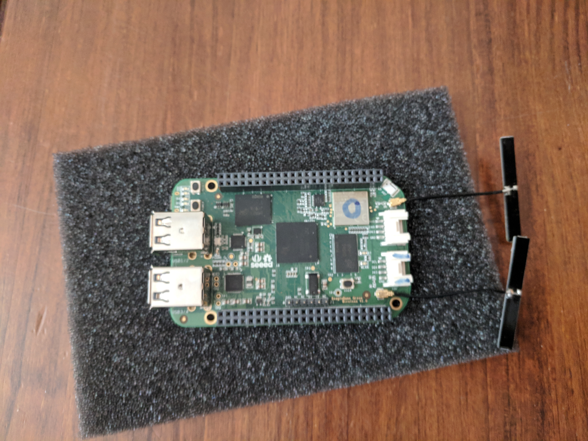
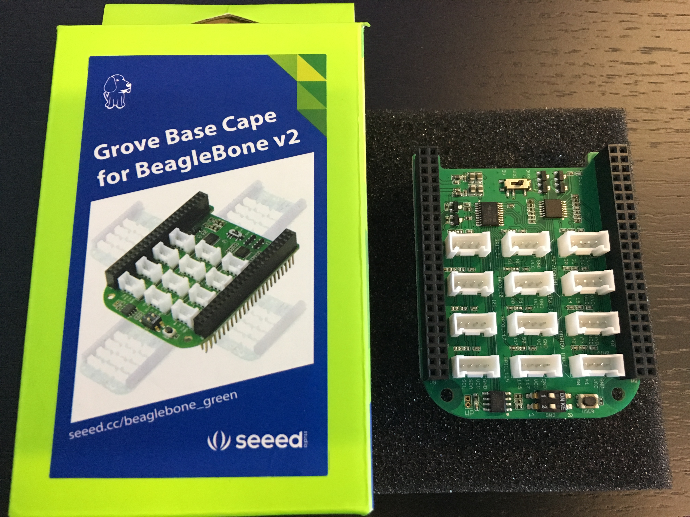
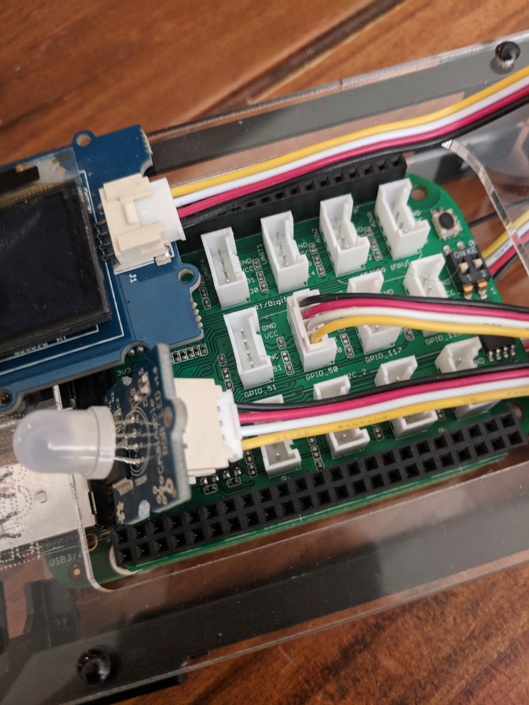

## Beaglebone Green Wireless Demo
The Beaglebone Green Wireless is a fantastic piece of hardware that is extremely powerful. And now it's easier than ever 
to work with because it comes pre-loaded with Debian!



NOTE: This README assumes you are familiar with the Beaglebone Green Wireless.

This project demonstrates how easy it is to build a Beaglebone Green IoT device and connect to the SpaceTime IoT Warp platform. 
This code has been tested with a Beaglebone Green Wireless, with a Grove Chainable RBG LED, Grove Temperature & Humidity Sensor Pro,
and the Grove OLED 64x64 Display.

If you are starting from scratch, please follow the instructions for [Getting Started](http://beagleboard.org/getting-started). Once you have your Beaglebone connected and accessible, go ahead and SSH onto the device.

This project is composed of several Python scripts, two Java apps, and an Android app. The Python scripts do the actual
controlling of the Beaglebone sensors. The main script to run all the parts in the background is `run_bbg.sh`. This simply
runs the main python script `iot_demo.py` and the java application started by `run_bbg_java.sh`. This needs to be run as `sudo`.

    $ sudo ./run_bbg.sh

It is possible to run the the python `iot_demo.py` and `run_bbg_java.sh` in separate terminals if you are interested in the
console output. Please note that `run_bbg_java.sh` has an option to set the log level. The default is `severe`. These are
standard Java log levels. If you want more detail, try `info`.

The Java application implements the Nucleus SDK that provides connectivity and reads sensor data
and writes out control changes. Their is also a standalone java Console application that allows you to send messages and LED changes
to the Beaglebone from the command line of any computer. Simply unzip the release onto the other computer in any working directory and 
then type `./run_console.sh`. The Android application is a very simple mobile application that allows
you to control the LED on the Beaglebone, as well as send messages to be displayed on the OLED screen.

This tutorial goes over assembling the kit and getting started with a dashboard of your own. Specifically, you will:

* Assemble the Beaglebone Green Wireless with Seeed Grove Cape
* Installing the release which includes python scripts to control the sensors and the java app to connect to Nucleus 
developed with the Warp IoT SDK
* Read from Grove plug-and-play sensors
* Send collected data to a real-time mobile application developed with the Warp IoT SDK

#### What Exactly Can You Do?
This project demonstrates how to stream telemetry data, temperature and humidity, from the Beaglebone Green Wireless 
to the SpaceTime IoT Warp Platform via the Warp IoT SDK. It also demonstrates how to send back messages to the device 
to control it. Their are two elements on the Beaglebone that you can control, the LED light and the message displayed 
on the OLED screen. When there is no specific message being displayed, or after 5 minutes of displaying the custom 
message, the device switches back to display the temperature and humidity.

Let's get started!


### Connecting The Hardware
The parts to build this project include:

1) [Beaglebone Green Wireless Development Board](https://www.seeedstudio.com/Beaglebone-Green-Wireless-Development-Board%EF%BC%88TI-AM335x-WiFi%2BBT%EF%BC%89-p-2650.html)
2) [Grove Base Cape for Beaglebone v2.0](https://www.seeedstudio.com/Grove-Base-Cape-for-Beaglebone-v2.0-p-2644.html)
3) [Temperature & Humidity Sensor Pro](https://www.seeedstudio.com/Grove-Temperature%26Humidity-Sensor-Pro%EF%BC%88AM2302%EF%BC%89-p-838.html)
5) [Seeedstudio Grove Starter Kit for Beaglebone Green](https://www.amazon.com/gp/product/B018FNOJUK/ref=oh_aui_detailpage_o07_s00?ie=UTF8&psc=1)

 
The Starter Kit

 
The OLED Display and LED Chainable Sensor are part of the Starter Kit


The assembled device top view


The assembled device rear view

#### Connecting The Sensors
An internet connected device is only as great as what you do with it! The Grove cape gives us a plug-and-play interface 
for connecting sensors to the Beaglebone so that we can read their values and turn right around and stream them.


First, connect the OLED Display to the IC2 Grove Connector on the Beaglebone Green Wireless development board. 
Next, connect the Temperature & Humidity Sensor Pro to the UART Grove Connector to the right on the Beaglebone Green Wireless development board.


Attaching the Grove cape is super easy - just line up the curved side of the cape with the curved side of the 
Beaglebone Green cape, make sure the P8 and P9 headers are aligned with the cape's pins and gently press down. 

Finally, find the GPIO grove connector marked 50 and attach the LED Chainable Sensor


# WARNING
```
ALWAYS SHUTDOWN THE DEVICE EITHER BY PRESSING THE POWER BUTTON (see documentation on the Beaglebone) OR 
BY ISSUING THE SHUTDOWN COMMAND. 

UNPLUGGING THE POWER CAN CAUSE DAMAGE.
```    


#### Logging On Using Screen
When you connect the Beaglebone to your laptop using the USB, you have two options of connecting. The first is to use screen. 
The second is to use SSH. Sometimes the usb network connection does not always get set up correctly, so the fallback
is always the `screen` command. In either case, to confirm that the Beaglebone is mounted to your laptop, you should
find the tty in dev.

```
$ ls /dev/tty*usb*
```
Sometimes the device will show up as a usbmodem, othertimes it will show up as as usbserial. Here is an example of logging
in using screen where the device is identified as `tty.usbmodem1425`

```
$ screen /dev/tty.usbmodem1425 115200
```

#### Logging On Using SSH
As the documentation explains, the mounted device should set up a USB network between the laptop and the device. The
address of the device will be 192.168.7.2.

#### Configuring The Wifi
There are [instructions](https://beagleboard.org/green-wireless) for configuring the wifi on the Beaglebone by connecting 
to the SeeedStudio BeagleBone Green Wireless AP and then selecting your SSID and entering your passphrase.

This does not always work. If it doesnt, the you will need to configure it manually by logging onto the device using either
screen or ssh, and type the following

	$ connmanctl (invoke utility)
	connmanctl> tether wifi off (disable tethering)
	connmanctl> enable wifi (enable wifi radio)
	connmanctl> scan wifi (scan for AP, might take a few seconds)
	connmanctl> services (display detected AP)
	connmanctl> agent on (enable connection agent)
	connmanctl> connect wifi_*_managed_psk (connect to selected AP, might take some time, will prompt for password)
	connmanctl> quit
	
Test your connection...

    $ ping yahoo.com	

### Update The Software
When you're in, update your software:

```
apt-get update
apt-get upgrade
```
Now update your kernel (you should be running Debian by default) and reboot:

```
cd /opt/scripts/tools/
./update_kernel.sh
reboot
```

Your SSH connection should drop, but you can pull it back up as soon as the Beaglebone finishes rebooting.

> Note: These commands should all work if you are SSHed in as the root user. If you're working as the debian user, you may need to add "sudo" to the front of the commands. The default password for the Beaglebone is "temppwd".

Next, you will need to have Java 8 JDK [installed on your BBG](http://beagleboard.org/project/java/). 


## Building Your Project
Everything you need to build, or rebuild the project, is included in this project. The project uses Gradle and 
includes a `build.gradle`. If you are using Eclipse or IntelliJ, simply import the project from sources. Please note, this
project is to be built on your laptop, not the Beaglebone. 

The tasks to build the project are: 

	./gradle clean build release
	
## Installing Your Release

After you have built the project, navigate to the `release` directory to find the `bbg-demo-1.0.zip` file. You will need to
secure copy this file to your Beaglebone Green. It is recommended that you make a bbgdemo directory on the Beaglebone Green
under the home directory.

    $ scp release/bbg-demo-1.0.zip debian@<ip-addresss>:bbgdemo

Back on the device, unzip the file. You will see the executable JAR and supporting libraries.

Next, edit the local.properties file and set the api_accountid, api_accounttoken, api_key, and api_token to the values 
of your account and partition from the nucleus application console. For the out of the box demo, simply copy the 
`local-template.properties` file to `local.properties`. This will have the necessary credentials and tokens to connect
to the SpaceTime demo server.

    $ cp local-template.properties local.properties

Also, if you want your device to be at a specific location in the world, be sure to edit the `local.properties` file and 
set the latitude and longitude of your station, along with its name, and a site name.

To find you location, simply open [https://www.google.com/maps](https://www.google.com/maps) and find your location on the map. 
Zoom in to get a precise location (or enter the address). Click and hold for a moment and you will get the latitude and longitude 
coordinates of that location.

To test that everything is working, run each of the components in two separate terminal windows. In the first window, start 
up the Python scripts that will drive the sensors 

	$ sudo python iot_demo.py
	
In the second window, start up that Java application

    $ sudo ./run_bbg_java.sh
    
Your Beaglebone Green should now be reporting the temperature and humidity of your location and should be displaying it on
the OLED screen. Please note that the LED flashes on startup. It does take a minute to startup.

Once you have confirmed everything is in working order, CTRL-C out of each of the apps and then in a single terminal run 
the single script:

    $ sudo ./run_bbg.sh
    
### Setting Up To Run On Boot
Once you have determine everything is working as advertised, if you want the device to run on boot, copy the `rc.local` 
to `/etc`. The script `/etc/rc.local` is for use by the system administrator. It is traditionally executed after all the 
normal system services are started, at the end of the process of switching to a multiuser runlevel.

    $ cp rc.local /etc 

PLEASE NOTE: That if you are demoing or have moved this device to a new network, you will need to first set up the WiFi following
the instructions above. In this case, after you set up the WiFi, issue a reboot from the command line.

    $ sudo reboot 


The assembled device running


## Using The Command Line Console
To control the LED or send a message, back on your laptop, you can either unzip the `bbg-demo-1.0.zip` in the release directory, 
or move it to another temp directory. In it, you will find another script called `bbg_console.sh`. If you run this, you can
now send messages to your Beaglebone.

    $ ./run_console.sh
    Nov 14, 2017 10:44:27 AM com.spacetimeinsight.example.bbgdemo.Console main
    INFO: Starting up beaglebone demo console...
    Setting log level to severe
    Successfully joined channel. channelRef=c32afd459_6729_4f10_b838_f8973fe173ff
    Enter command: (m <message> , l <led comma separated values R,G,B>, or s to shutdown)
    
Enter `m` followed by a space and then the message, `l` (lowercase L) followed by a space and then comma separated RBG values,
or `s` to shutdown the device.

```
ALWAYS SHUTDOWN THE DEVICE. UNPLUGGING THE POWER CAN CAUSE DAMAGE.
```    

## Using The Android App
Finally, if you have an Android development phone and environment available, build the Android APK and deploy it onto your
phone. This modest app will demonstrate temperature and humidity sensor data ingestion as well as how to control your 
Beaglebone with your phone. You can change the LED values of the light (to turn it off give 0,0,0) as well as push a message
to the OLED display.


The assembled device running


 