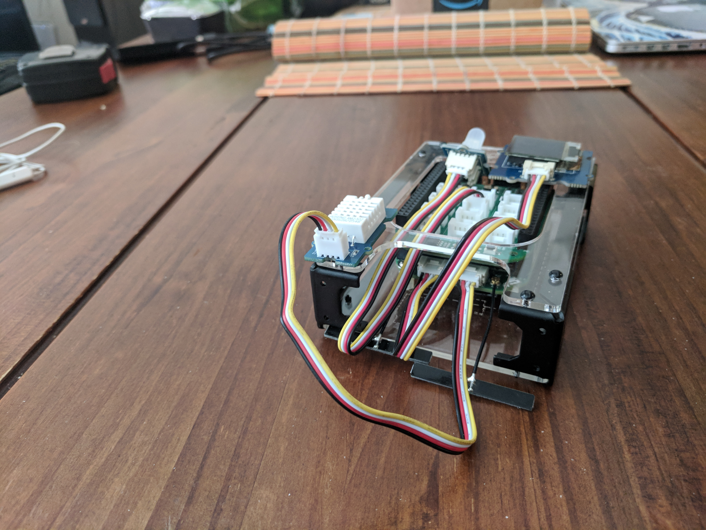

## Beaglebone Green Wireless Demo
The Beaglebone Green Wireless is a fantastic piece of hardware that is extremely powerful. And now it's easier than ever 
to work with because it comes pre-loaded with Debian!


NOTE: This README assumes you are familiar with the Beaglebone Green Wireless.

This project demonstrates how easy it is to build a Beaglebone Green IoT device and connect to the SpaceTime IoT Warp platform 
using the Nucleus SDKs.  This code has been tested with a Beaglebone Green Wireless, a Grove Chainable RBG LED, Grove 
Temperature & Humidity Sensor Pro, and the Grove OLED 64x64 Display.

This project provides the following features:

- Stream real-time temperature, humidity, and GPS sensor data from the IoT Device
- Control the LED light on the IoT Device from your Android phone or a command line
- Display a message on the OLED screen of the IoT Device from your Android phone or a command line
- Ask the IoT Device chat bot running on the device questions, such as "how hot is it?"

The project includes the following components:

- A Beaglebone Green Wireless IoT Devices with temperature, humidity, and GPS sensor inputs
- A Java console command line app to control the IoT Device
- An Android app to view the sensor data, control the device, find it on a map, and chat with the chat bot

This project demonstrates several key features of the Space Time IoT Platform that would the basis for any application, 
and just how incredibly fast it is to build an end to end solution.

- Using the Java SDK to drive an embedded network connected device (the Beaglebone)
- Using the Android SDK to build a mobile app to connect with, stream from, and control the IoT Device
- Using a `channel`
- Using `channel properties` to control devices connected to a shared channel
- Real-time messaging by `publishing chat messages` on the channel
- Listening to changes in the channel topics, specifically the `telemetry topic`, `member_location`, `channel_messages`, and `properties`

If you are starting from scratch, please follow the instructions for [Getting Started](http://beagleboard.org/getting-started). 
Once you have your Beaglebone connected and accessible, go ahead and SSH onto the device.

This project is composed of several Shell and Python scripts, two Java apps, and an Android app. The Python scripts do the actual
controlling of the Beaglebone sensors. Once you install the demo, it should then always start at boot and you are done. 

It is possible to run the the python `iot_demo.py` and `run_bbg_java.sh` in separate terminals if you are interested in the
console output. Please note that `run_bbg_java.sh` has an option to set the log level. The default is `severe`. These are
standard Java log levels. If you want more detail, try `info`.

In terminal #1

    $ sudo python ./iot_demo.py

In terminal #2

    $ sudo ./run_bbg_java.sh
    
*NOTE:* This needs to be run as `sudo`.    

The Java application implements the Nucleus SDK that provides connectivity and reads sensor data and writes out control 
changes. The Python scripts to the actual reading and control of the various sensors. 

There is also a standalone java Console application that allows you to send messages and LED changes to the 
Beaglebone from the command line of any computer. Simply unzip the release onto the other computer in any working 
directory and then type `./run_console.sh`. The Android application is a very simple mobile application that allows
you to control the LED on the Beaglebone, as well as send messages to be displayed on the OLED screen.

This tutorial goes over assembling the kit and getting started with a dashboard of your own. Specifically, you will:

* Assemble the Beaglebone Green Wireless with Seeed Grove Cape
* Installing the release which includes python scripts to control the sensors and the java app to connect to Nucleus 
developed with the Warp IoT SDK
* Read from Grove plug-and-play sensors
* Send collected data to a real-time mobile application developed with the Warp IoT SDK

#### What Exactly Can You Do?
This project demonstrates how to stream telemetry data, temperature and humidity, and GPS location data from the 
Beaglebone Green Wireless to the SpaceTime IoT Warp Platform via the Warp IoT SDK. It also demonstrates how to send 
back messages to the device to control it. Their are two elements on the Beaglebone that you can control, the LED light 
and the message displayed on the OLED screen. When there is no specific message being displayed, or after 5 minutes of 
displaying the custom message, the device switches back to display the temperature and humidity.

Let's get started!


### Connecting The Hardware
The parts to build this project include:

1) [Beaglebone Green Wireless Development Board](https://www.seeedstudio.com/Beaglebone-Green-Wireless-Development-Board%EF%BC%88TI-AM335x-WiFi%2BBT%EF%BC%89-p-2650.html)
2) [Grove Base Cape for Beaglebone v2.0](https://www.seeedstudio.com/Grove-Base-Cape-for-Beaglebone-v2.0-p-2644.html)
3) [Temperature & Humidity Sensor Pro](https://www.seeedstudio.com/Grove-Temperature%26Humidity-Sensor-Pro%EF%BC%88AM2302%EF%BC%89-p-838.html)
5) [Seeedstudio Grove Starter Kit for Beaglebone Green](https://www.amazon.com/gp/product/B018FNOJUK/ref=oh_aui_detailpage_o07_s00?ie=UTF8&psc=1)
6) [Seeedstudio Grove GPS](http://www.seeedstudio.com/depot/Grove-GPS-p-959.html)

 
The Starter Kit

 
The OLED Display and LED Chainable Sensor are part of the Starter Kit


The assembled device top view


The assembled device rear view

#### Connecting The Sensors
An internet connected device is only as great as what you do with it! The Grove cape gives us a plug-and-play interface 
for connecting sensors to the Beaglebone so that we can read their values and turn right around and stream them.


First, connect the OLED Display to the IC2 Grove Connector on the Beaglebone Green Wireless development board. 
Next, connect the Temperature & Humidity Sensor Pro to the UART Grove Connector to the right on the Beaglebone Green Wireless development board.


Attaching the Grove cape is super easy - just line up the curved side of the cape with the curved side of the 
Beaglebone Green cape, make sure the P8 and P9 headers are aligned with the cape's pins and gently press down. 

Next, find the GPIO grove connector marked 50 and attach the LED Chainable Sensor


Finally, connect the GPS to UART 4 on the Grove cape.  

# WARNING
```
ALWAYS SHUTDOWN THE DEVICE EITHER BY PRESSING THE POWER BUTTON (see documentation on the Beaglebone) OR 
BY ISSUING THE SHUTDOWN COMMAND. 

UNPLUGGING THE POWER CAN CAUSE DAMAGE.
```    


#### Logging On Using Screen
When you connect the Beaglebone to your laptop using the USB, you have two options of connecting. The first is to use screen. 
The second is to use SSH. Sometimes the usb network connection does not always get set up correctly, so the fallback
is always the `screen` command. In either case, to confirm that the Beaglebone is mounted to your laptop, you should
find the tty in dev.

```
$ ls /dev/tty*usb*
```
Sometimes the device will show up as a usbmodem, othertimes it will show up as as usbserial. Here is an example of logging
in using screen where the device is identified as `tty.usbmodem1425`

```
$ screen /dev/tty.usbmodem1425 115200
```

#### Logging On Using SSH
As the documentation explains, the mounted device should set up a USB network between the laptop and the device. The
address of the device will be 192.168.7.2.

> Note: These commands should all work if you are SSHed in as the root user. If you're working as the debian user, which
is recommended, you may need to add "sudo" to the front of the commands. The default password for the Beaglebone is "temppwd".


#### Configuring The Wifi
There are [instructions](https://beagleboard.org/green-wireless) for configuring the wifi on the Beaglebone by connecting 
to the SeeedStudio BeagleBone Green Wireless AP and then selecting your SSID and entering your passphrase.

This does not always work. If it doesnt, the you will need to configure it manually by logging onto the device using either
screen or ssh, and type the following

	$ connmanctl (invoke utility)
	connmanctl> tether wifi off (disable tethering)
	connmanctl> enable wifi (enable wifi radio)
	connmanctl> scan wifi (scan for AP, might take a few seconds)
	connmanctl> services (display detected AP)
	connmanctl> agent on (enable connection agent)
	connmanctl> connect wifi_*_managed_psk (connect to selected AP, might take some time, will prompt for password)
	connmanctl> quit
	
Test your connection...

    $ ping yahoo.com	

### Update The Software
When you're in, you will need to make sure that the UART-4 serial port is enabled. To do this, you will need to edit
the `/boot/uEnv.txt`. Be very careful modifying this file.

    $ sudo vi /boot/uEnv.txt 

Find the section for v4.1.x and uncomment the `cape_enable` and then add `BB_UART4`

```
##Example v4.1.x
#cape_disable=bone_capemgr.disable_partno=
cape_enable=bone_capemgr.enable_partno=BB-UART4
```

After reboot, the device is present in the device list. UART-4 is linked as ttyO4:

```
$ ls -l /dev/ttyO*
lrwxrwxrwx 1 root root 5 Nov 26 23:00 /dev/ttyO0 -> ttyS0
lrwxrwxrwx 1 root root 5 Nov 26 23:00 /dev/ttyO3 -> ttyS3
lrwxrwxrwx 1 root root 5 Nov 26 23:00 /dev/ttyO4 -> ttyS4
```

Next, update your software:

    $ sudo apt-get update
    $ sudo apt-get upgrade

Now update your kernel (you should be running Debian by default) and reboot:


    $ cd /opt/scripts/tools/
    $ git pull
    $ sudo ./update_kernel.sh
    $ sudo reboot

Your SSH connection should drop, but you can pull it back up as soon as the Beaglebone finishes rebooting.
Once the device has rebooted, create a working directory that you will install and run the release from

    $ mkdir /home/debian/bbgdemo    

### Installing Java

Next, you will need to manually download and install Java 8 JDK [installed on your BBG](http://beagleboard.org/project/java/) 
on your Beaglebone. Install it at `/opt/java` and then link it (assuming you are installing jdk1.8.0_151). Unfortunately
the apt-get install seems to be broken.

    $ cd /opt/java
    $ $ sudo ln -s ./jdk1.8.0_151/ ./jdk 

### Installing The Python Components

First, make sure your Python is up to date. This is all done on the Beaglebone. 

    $ sudo apt-get install build-essential python-dev

Next, you will need to download the [Adafruit Python DHT Sensor Library](https://github.com/adafruit/Adafruit_Python_DHT.git)

    $ cd ~
    $ git clone https://github.com/adafruit/Adafruit_Python_DHT.git 
    
Change into the directory and follow the instructions in the README.md.

Finally, you will need to install the [Adafruit Python ADXL345](https://github.com/adafruit/Adafruit_Python_ADXL345) libraries. You
can either do this manually, or you can install from pip with:

    $ sudo pip install adafruit-adxl345        

## Building Your Project
You should now be ready to build your project. Everything you need is included. The first step is to build and create
your release on your laptop. Please note that this has only been tested on a Mac and NOT on Windows. The project uses 
Gradle and includes a `build.gradle`. If you are using Eclipse or IntelliJ, simply import the project from sources. 
Please note, this project is to be built on your laptop, not on the Beaglebone. 

The tasks to build the project are: 

	$ ./gradle clean build release
	
You should see the following output:

```
    $ gradle clean build release
        
    > Task :java:prepareRelease
    Creating release - java
    
    
    BUILD SUCCESSFUL in 1s
    8 actionable tasks: 8 executed
```

## Installing Your Release

After you have built your release, navigate to the `release` directory to find the `bbg-demo-1.0.zip` file. You will need to
secure copy this file to your Beaglebone Green. It is recommended that you make a bbgdemo directory on the Beaglebone Green
under the home directory.

    $ scp release/bbg-demo-1.0.zip debian@<ip-addresss>:bbgdemo
    
For example, on the Beaglebone, is a working directory called `bbgdemo` in the debian home directory:

```
    $ scp release/bbg-demo-1.0.zip debian@192.168.43.224:bbgdemo
    Debian GNU/Linux 8
    
    BeagleBoard.org Debian Image 2016-11-06
    
    Support/FAQ: http://elinux.org/Beagleboard:BeagleBoneBlack_Debian
    
    default username:password is [debian:temppwd]
    
    debian@192.168.43.224's password:
```

Back on the device, unzip the file and run `install_bbgdemo.sh`

    $ sudo ./install_bbgdemo.sh
    
This will copy over the `local.properties` using the default template and create the `serial.dat` file, and install the
`rc.local` boot file. Note, this demo out of the box uses the Space Time demo Nucleus server. If you run this application 
out of a different partition or server, you will need to update the `local.properties` file accordingly.    

If you do this, edit the local.properties file and set the api_accountid, api_accounttoken, api_key, and api_token to the values 
of your account and partition from the nucleus application console. 

Also, if you want to custom your device, you can change the device name here, as well as the channel name. Please note that
if you change the name, you will need to update this in the local.properties for the Java Console app, as well as in
the `Config.java` file in the Android project.

The BBG Demo includes a Grove GPS. If for whatever reason this is not working, you can manually set your devices location, 
also in the `local.properties`. To find you location, simply open [https://www.google.com/maps](https://www.google.com/maps) 
and find your location on the map. Zoom in to get a precise location (or enter the address). Click and hold for a moment 
and you will get the latitude and longitude coordinates of that location.

Please note that the GPS reading from the device will over write any manually set location.

To test that everything is working, run each of the components in two separate terminal windows. In the first window, start 
up the Python scripts that will drive the sensors 

	$ sudo python iot_demo.py
	
In the second window, start up that Java application

    $ sudo ./run_bbg_java.sh
    
Your Beaglebone Green should now be reporting the temperature and humidity of your location and should be displaying it on
the OLED screen. Please note that the LED flashes on startup. It does take a minute to startup.

Finally, you will need to set up `logrotate` to ensure that the log files do not fill up the device. 

    $ sudo vi /etc/logrotate.conf
    
And add the following to the bottom of the file    
 
```    
/var/log/bbg_java.log {
    missingok
    daily
    create 0664 root utmp
    rotate 1
}

/var/log/bbg_python.log {
    missingok
    daily
    create 0664 root utmp
    rotate 1
}
```

Once you have confirmed everything is in working order, CTRL-C out of each of the apps and reboot your device. Everything
should start running


The assembled device running

    
## Using The Command Line Console
To control the LED or send a message, back on your laptop, you can either unzip the `bbg-demo-1.0.zip` in the release directory, 
or move it to another temp directory. In it, you will find another script called `bbg_console.sh`. If you run this, you can
now send messages to your Beaglebone.

    $ ./run_console.sh
    Nov 14, 2017 10:44:27 AM com.spacetimeinsight.example.bbgdemo.Console main
    INFO: Starting up beaglebone demo console...
    Setting log level to severe
    Successfully joined channel. channelRef=c32afd459_6729_4f10_b838_f8973fe173ff
    Enter command: (m <message> , l <led comma separated values R,G,B>, or s to shutdown)
    
Enter `m` followed by a space and then the message, `l` (lowercase L) followed by a space and then comma separated RBG values,
or `s` to shutdown the device.

```
ALWAYS SHUTDOWN THE DEVICE. UNPLUGGING THE POWER CAN CAUSE DAMAGE.
```    

## Using The Android App
Finally, if you have an Android development phone and environment available, build the Android APK and deploy it onto your
phone. This modest app will demonstrate temperature and humidity sensor data ingestion as well as how to control your 
Beaglebone with your phone. You can change the LED values of the light (to turn it off give 0,0,0) as well as push a message
to the OLED display.


The assembled device running


 